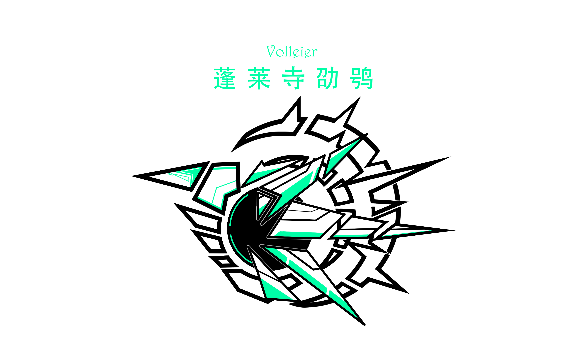

  
  
  

<table style="border-collapse: collapse; width: 100%;"align="center">
  <tr style="border: none;">
    <td align="center"></td>
    <td align="center"></td>
  </tr>
</table>

<picture>
  <source media="(prefers-color-scheme: dark)" srcset="https://github-readme-activity-graph.vercel.app/graph?username=Volleier&theme=xcode&bg_color=FF000000&hide_border=true" />
  <source media="(prefers-color-scheme: dark)" srcset="https://github-readme-activity-graph.vercel.app/graph?username=Volleier&theme=xcode&bg_color=FF000000&color=000000&hide_border=true" />
  
</picture>

  

  

 

