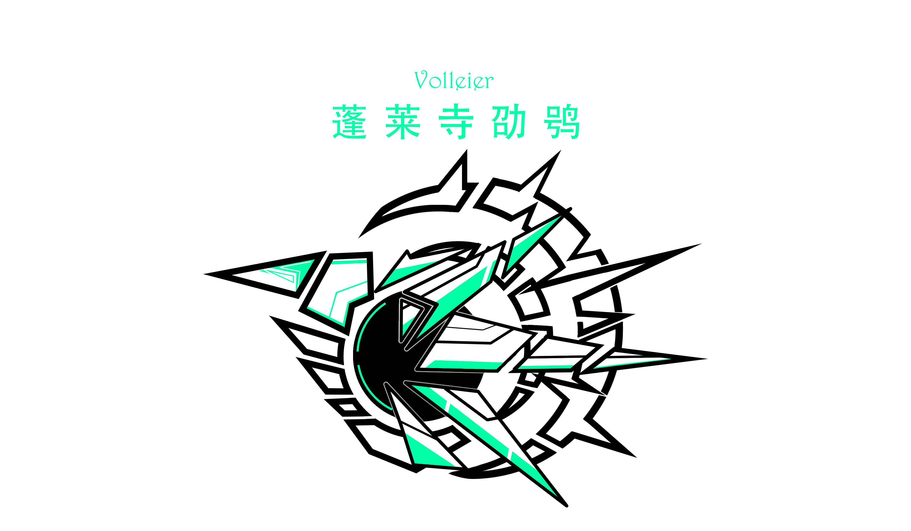

  
  
  <h1>Hi, I'm Volleier (蓬莱寺劭鸮) 👋</h1>

  

  

    
    
    
  

## 💫 About Me

- 🎓 **Education**: A student passionate about technology, game development, and digital art.
- 💻 **Programming**: Focused on software engineering, gameplay mechanics, and creative coding.
- 🎨 **Art & Design**: An illustrator creating concept designs and anime-style digital illustrations.
- 🎮 **Game Creation**: Crafting interactive worlds and games using Unity and Unreal Engine.

## 📊 My Git & Coding Stats

<table style="border-collapse: collapse; width: 100%; border: none;" align="center">
  <tr style="border: none;">
    <td align="center" style="border: none; padding: 5px; width: 50%;">
      
    </td>
    <td align="center" style="border: none; padding: 5px; width: 50%;">
      
    </td>
  </tr>
  <tr style="border: none;">
    <td align="center" style="border: none; padding: 5px; width: 50%;">
      
    </td>
    <td align="center" style="border: none; padding: 5px; width: 50%;">
      
    </td>
  </tr>
</table>

 

<picture>
  <source media="(prefers-color-scheme: dark)" srcset="https://github-readme-activity-graph.vercel.app/graph?username=Volleier&theme=gotham&bg_color=00000000&hide_border=true" />
  <source media="(prefers-color-scheme: light)" srcset="https://github-readme-activity-graph.vercel.app/graph?username=Volleier&theme=github&bg_color=00000000&hide_border=true" />
  
</picture>

## 🛠️ Tech Stack & Tools

<table style="border-collapse: collapse; width: 100%; border: none;">
  <tr style="border: none;">
    <td valign="top" width="50%" style="border: none; padding: 10px;">
      <h3>💻 Languages & Frameworks</h3>
      
    </td>
    <td valign="top" width="50%" style="border: none; padding: 10px;">
      <h3>🎮 Game Engines & Tools</h3>
      
    </td>
  </tr>
  <tr style="border: none;">
    <td valign="top" colspan="2" style="border: none; padding: 10px;">
      <h3>🎨 Design & Creative</h3>
      
    </td>
  </tr>
</table>

 
